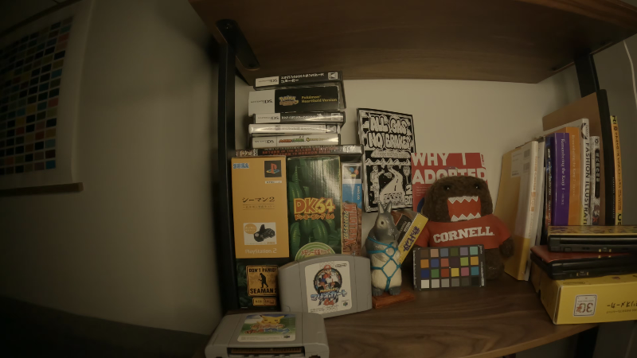
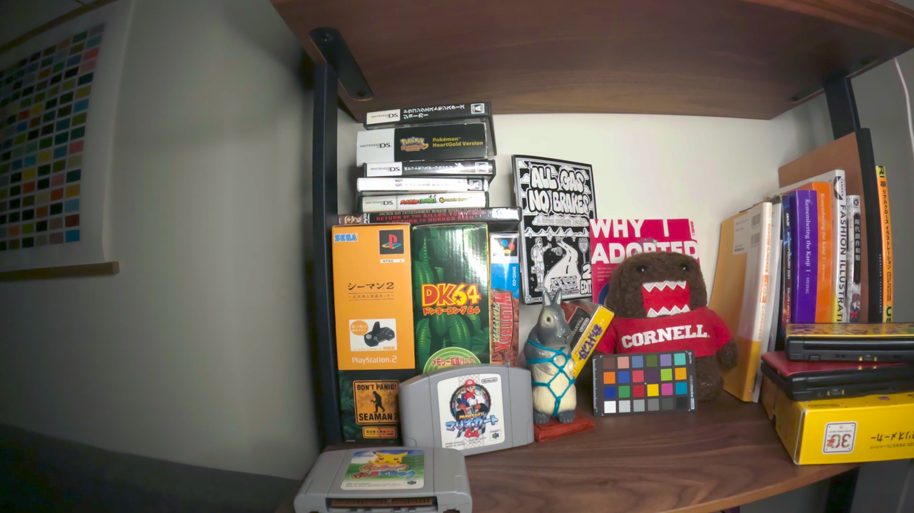
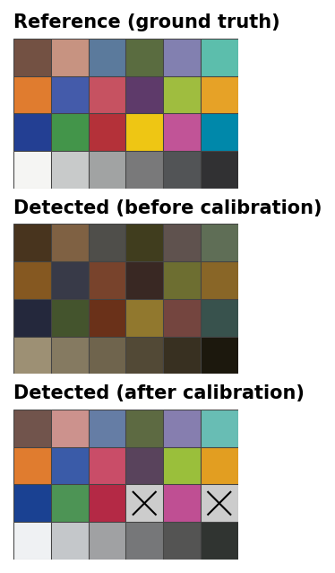

# chromacal

[](LICENSE)

ColorChecker camera calibration with correct color science. Detect the chart, solve for a color profile, apply it — three functions, one library.

## What it does

chromacal fits a **log-polynomial tone curve + 3x3 color correction matrix** to ColorChecker patch measurements using non-linear optimization. Unlike OpenCV's basic `ccm` module, chromacal:

- **Jointly fits tone curve and CCM** — no need to manually linearize first
- **Weights by measurement uncertainty** — per-patch covariance (Mahalanobis distance) so noisy patches matter less
- **Down-weights bad patches** — a robust per-patch reliability score (outlier fraction vs. the chi-square expectation) lets the solver gracefully discount patches with specular reflections or occlusions, without discarding them; an optional normality filter is also available for pristine captures
- **Perceptually weights** — darker and more saturated colors get higher weight (where cameras struggle most)
- **Generates OCIO 3D LUTs** — apply calibration via OpenColorIO for GPU-accelerated or batch processing

## Example

Before and after calibration on a GoPro Hero10 frame (ColorChecker visible in scene):

| Before | After |
|--------|-------|
|  |  |

**Detected patches:** 24 of 24

**Fitted tone curve coefficients:** `[1.377, 3.479, 0.739, 0.072]`

**Fitted color correction matrix:**
```
[[ 1.586  -0.638  -0.214]
 [-0.303   1.826  -0.294]
 [-0.014  -0.449   3.000]]
```

The off-diagonal entries show the GoPro sensor has significant blue-channel crosstalk that the CCM corrects. The tone curve coefficients (far from the identity `[0, 1, 0, 0]`) indicate the camera's built-in processing applies a heavy tonal response.

### Patch comparison

Detected patch colors before and after calibration, compared to ground truth:



The "after" row closely matches the reference — saturated colors are recovered and the grayscale ramp is neutral.

### Re-detection identity check

Detecting the ColorChecker in the *corrected* image and solving again should produce a near-identity transform, confirming the calibration was applied correctly:

```python
# Apply calibration
corrected = solver.infer(rgb_image)  # linear RGB float64

# detect() requires uint8, so we must quantize. Linear values in 8-bit
# have poor precision in the darks (causing patch detection failures),
# so we apply the sRGB transfer function before quantizing.
corrected_srgb = linear_to_srgb(corrected)
corrected_8bit = (corrected_srgb * 255).astype(np.uint8)

# Re-detect and re-solve on the corrected image
patches2 = chromacal.detect(cv2.cvtColor(corrected_8bit, cv2.COLOR_RGB2BGR))
solver2 = chromacal.Solver()
solver2.solve(patches2)

print(solver2.get_ccm())        # near identity
print(solver2.get_luma_params()) # absorbs sRGB transfer function
```

**Re-detection CCM (24/24 patches):**
```
[[ 1.006  -0.011   0.013]
 [-0.003   0.999   0.010]
 [ 0.005  -0.001   0.999]]
```

**Re-detection tone curve:** `[0.013, 2.316, 0.116, 0.018]`

The CCM is within 1.3% of the identity matrix — the color correction has already been applied. The tone curve departs from `[0, 1, 0, 0]` because it absorbs the sRGB transfer function applied during the uint8 quantization step.

## Usage

### Python

```python
import chromacal
import cv2

image = cv2.imread("colorchecker.jpg")

# 1. Detect — find the chart and extract patch statistics
patches = chromacal.detect(image)
# (optional) cull patches up front on pristine captures:
#   patches = chromacal.filter_normal(patches)

# 2. Solve — fit the color profile (down-weights unreliable patches internally)
solver = chromacal.Solver()
solver.solve(patches)
solver.save("calibration.yml")

# 3. Apply — correct any image from this camera
lut = chromacal.create_lut(solver)
corrected = chromacal.apply_lut(image, lut)  # float32 RGB
```

### C++

```cpp
#include <chromacal/chromacal.h>

cv::Mat image = cv::imread("colorchecker.jpg");

// Detect
auto patches = chromacal::detect(image);
// (optional) patches = chromacal::filter_normal(patches);

// Solve — down-weights unreliable patches internally
chromacal::Solver solver;
solver.solve(patches);
solver.save("calibration.yml");

// Apply via OCIO 3D LUT
auto lut = chromacal::create_lut(solver);
cv::Mat corrected = chromacal::apply_lut(rgb_image, lut);
```

### As a CMake dependency

```cmake
include(FetchContent)
FetchContent_Declare(
    chromacal
    GIT_REPOSITORY https://github.com/kmatzen/chromacal.git
    GIT_TAG main
)
FetchContent_MakeAvailable(chromacal)

target_link_libraries(your_target PRIVATE chromacal::chromacal)
```

## The algorithm

1. **Detection**: OpenCV's MCC24 detector locates the ColorChecker. Per-patch pixel statistics (mean, covariance) are computed after rejecting saturated pixels.

2. **Reliability scoring**: Each patch gets a robust reliability weight from the fraction of its pixels that are multivariate outliers (Mahalanobis distance beyond the chi-square expectation). This flags genuine contamination (specular highlights, occlusions) while tolerating mild gradients and 8-bit quantization, and — unlike a normality hypothesis test — it is stable with respect to the number of pixels in a patch. (An optional `filter_normal` step using Shapiro-Francia / Mardia / Henze-Zirkler tests is available for pristine, high-bit-depth captures.)

3. **Optimization**: Ceres Solver minimizes the perceptually-weighted Mahalanobis distance between predicted and reference colors (CIE Lab D50). The model has 13 parameters: 4 log-polynomial tone curve coefficients + 9 CCM entries. Huber loss reduces outlier influence, and each patch's residual is additionally scaled by its reliability weight. Neutral patches (18-23) get an auxiliary white balance constraint.

4. **Application**: The solver is baked into a 129^3 OCIO 3D LUT for fast per-pixel application. Input: gamma-encoded RGB. Output: linear RGB at reference exposure.

## Requirements

- C++17 compiler
- OpenCV 4.x (with `mcc` contrib module)
- [Ceres Solver](http://ceres-solver.org/)
- [OpenColorIO](https://opencolorio.org/)
- Eigen3
- pybind11 (optional, for Python bindings)

## Building

```bash
# C++ only
cmake -B build -DCMAKE_BUILD_TYPE=Release
cmake --build build

# With Python bindings
cmake -B build -DCHROMACAL_BUILD_PYTHON=ON
cmake --build build
```

## API

### `detect(image, exposure=1.0)`

Detect a ColorChecker in a BGR image and return patch statistics. Each returned
patch carries a `reliability` weight in (0, 1]; `Solver.solve` uses it to
down-weight contaminated patches automatically, so no explicit filtering step
is required.

### `filter_normal(patches)` *(optional)*

Remove patches that fail multivariate normality tests (Shapiro-Francia,
Mardia, Henze-Zirkler). This is an opt-in, aggressive cull intended for
pristine, high-bit-depth captures with flat, evenly-lit patches. Because
goodness-of-fit tests grow more sensitive with sample size, patches with many
pixels — or any 8-bit/compressed/downscaled image (such as the web-sized
`docs/before.png` example) — are frequently rejected as non-Gaussian even when
their mean color is perfectly usable. Prefer the built-in `reliability`
weighting (above) for most workflows.

### `Solver`

| Method | Description |
|--------|-------------|
| `solve(patches)` | Fit the tone curve + CCM to patch data |
| `infer(image)` | Apply calibration to an image (CV_64FC3 RGB) |
| `get_ccm()` | Get the 3x3 color correction matrix |
| `get_luma_params()` | Get the 4 log-polynomial coefficients |
| `save(path)` / `load(path)` | Serialize to/from YAML |

### `create_lut(solver, lut_size=129)`

Bake the calibration into an OCIO 3D LUT for fast application.

### `apply_lut(image, lut)`

Apply the 3D LUT to an image. Returns float32 RGB.

### `write_cube(solver, path, lut_size=33, title="chromacal")`

Write the calibration as an Iridas/Resolve `.cube` 3D LUT file, independent of
OpenColorIO. Drop the result into a DaVinci Resolve or Premiere/Lumetri LUT slot.
Input domain is gamma-encoded RGB in `[0, 1]`; output is linear RGB at the
reference exposure (written unclamped, so values may exceed `[0, 1]`).

## Premiere Pro / After Effects plugin

A native **video effect** ([`plugin/`](plugin/README.md)) brings Resolve-style
ColorChecker calibration to Premiere: an After Effects-style effect with an
*Analyze* button that detects the chart and applies the tone curve + CCM live in
the render pipeline. It can also **Export a `.cube`** for Lumetri's Input LUT
(the effect's exact transform; Premiere applies an Input LUT directly, so it
matches the effect — measured ~0.5% mean over the chart).

The SDK-free engine and a headless CLI build with no Adobe SDK at all:

```bash
cmake -B build -DCHROMACAL_BUILD_PPRO=ON
cmake --build build --target chromacal_solve
./build/plugin/chromacal_solve frame.png out.cube
```

## License

MIT
